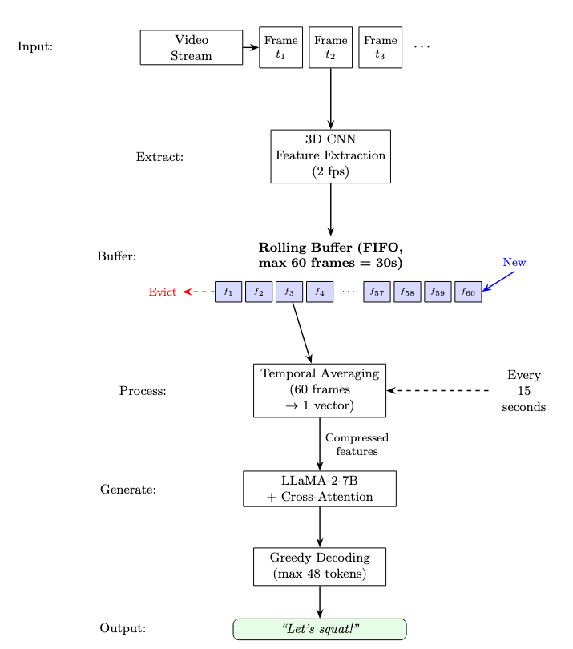

# Streaming Live Feedback System - Implementation Guide

This document describes the implementation details and reproduction instructions for the FitCoach streaming live feedback system.

## Overview

The streaming system transforms the offline FitCoach baseline into a real-time architecture capable of processing video incrementally with fixed memory requirements. The implementation consists of 4 key files:

1. `scripts/live_feedback_lightweight.py` - Core streaming implementation
2. `configs/live_lightweight.yaml` - Configuration parameters
3. `FitCoach_Live_Feedback.ipynb` - Interactive demo notebook (single video or webcam)
4. `FitCoach_Live_Evaluation.ipynb` - Full benchmark evaluation notebook

---

## File Descriptions

### 1. `scripts/live_feedback_lightweight.py`

**Purpose**: Main implementation of the streaming feedback system optimized for consumer hardware.

**Key Components**:

#### `LightweightFeedbackCoach` Class



- **Rolling Buffer**: Implements FIFO frame management

  - Default capacity: 200 preprocessed frames (100 seconds at 2 fps)
  - Automatically evicts oldest frames when full
  - Configurable via `max_buffer_size` parameter

- **Feature Extraction** (`preprocess_frame` method):

  - Uses 3D CNN's built-in preprocessing pipeline
  - Applies ImageNet normalization (embedded in `self.cnn_model.transforms()`)
  - Returns preprocessed frame as numpy array ready for buffering

- **Dynamic Feature Extraction** (`generate_feedback` method):

  - Operates on windowed subsets of the buffer (default: last 60 frames = 30 seconds)
  - Extracts CNN features on-demand using `self.cnn_model.features()`
  - Applies global average pooling over spatial dimensions
  - Performs temporal averaging to compress sequence to single vector
  - Reshapes to `[1, 1, 1, 1280]` format expected by LLaMA-2 adapter

- **Memory Optimizations**:

  - BFloat16 precision throughout (configured in YAML)
  - Reduced max feedback length: 48 tokens vs baseline's 128
  - Aggressive cache clearing with `torch.cuda.empty_cache()`
  - Out-of-memory recovery:
    - Clears CUDA cache
    - Reduces buffer to 20 frames minimum
    - Triggers Python garbage collection

- **Autoregressive Generation** (`_generate_single_feedback`):

  - Greedy decoding with temperature=0 for deterministic output
  - KV-cache enabled for efficiency

---

### 2. `configs/live_lightweight.yaml`

**Purpose**: Configuration file for streaming system parameters.

**Key Parameters**:

```yaml
model:
  llama2_7b_path: "./Llama-2-7b-hf"
  kwargs:
    checkpoint_path: "./ckpts_streamvlm/ckpts_streamvlm/state_dict.pth.tar"
    bf16: True # BFloat16 precision
    xattn_config:
      xattn_type: "dotprod"
      adapter_insert_layers: "[6, 8, 10, 12, 14, 16, 18, 20, 22]"
      # Cross-attention adapters at every 2 layers

evaluator:
  sampling_kwargs:
    do_sample: False # Greedy decoding (temperature=0)
    temperature: 0.
    max_feedback_length: 48 # Reduced from baseline's 128
    feats_frequency: 2 # Feature extraction at 2 fps
    feedback_interval: 15.0 # Generate feedback every 15 seconds
```

**Design Rationale**:

- **2 fps feature rate**: Balances temporal resolution with computational cost (baseline uses 4 fps)
- **15-second intervals**: Provides regular feedback while limiting GPU inference frequency
- **48 token limit**: Reduces KV-cache memory requirements by over 60% vs baseline
- **BFloat16**: Halves memory footprint with minimal quality impact

---

### 3. `FitCoach_Live_Feedback.ipynb`

**Purpose**: Interactive demo notebook for Google Colab providing **both** single-video processing and live webcam feedback.

**What it does**:

- **Option A - Single Video**: Upload and process a workout video with frame-by-frame feedback generation
- **Option B - Live Webcam**: Real-time webcam coaching with live feedback overlay displayed in the browser
- Provides immediate visual feedback during processing

---

### 4. `FitCoach_Live_Evaluation.ipynb`

**Purpose**: Full benchmark evaluation measuring system performance on all 74 videos from the QEVD-FIT-COACH dataset.

**What it does**:

- Processes all 74 benchmark videos sequentially in streaming mode
- Computes temporal precision/recall/F1 using 3-second matching window
- Evaluates text quality with METEOR, ROUGE-L, and BERT Score


# Original README from FitCoach:
# Stream-VLM

<p align="center">
  
</p>

Here we provide the code to evaluate the baseline Stream-VLM model in the paper:

[**Live Fitness Coaching as a Testbed for Situated Interaction (NeurIPS 2024 D&B Track)
**](https://arxiv.org/pdf/2407.08101)

## Abstract

Vision-language models have shown impressive progress in recent years. However, existing models are
largely limited to turn-based interactions, where each turn must be stepped (i.e., prompted) by the
user. Open-ended, asynchronous interactions, where an AI model may proactively deliver timely
responses or feedback based on the unfolding situation in real-time, are an open challenge. In the
paper "Live Fitness Coaching as a Testbed for Situated Interaction (NeurIPS 2024 D&B Track)", we
present the QEVD benchmark and dataset, which explores human-AI interaction in the challenging, yet
controlled, real-world domain of fitness coaching -- a task which intrinsically requires monitoring
live user activity and providing immediate feedback. The benchmark requires vision-language models
to recognize complex human actions, identify possible mistakes, and provide appropriate feedback in
real-time. Our experiments reveal the limitations of existing state-of-the-art vision-language
models for such asynchronous situated interactions. Motivated by this, we propose a simple
end-to-end streaming baseline (Stream-VLM model) that can respond asynchronously to human actions
with appropriate feedback at the appropriate time. This repository contains the code to evaluate
the baseline Stream-VLM model.

## Running the Code

### Getting Started

First, clone the repository using the following command:

```
git clone https://github.com/Qualcomm-AI-research/FitCoach.git $REPO_PATH
cd $REPO_PATH
```

Here, *$REPO_PATH* is the desired location to download the repository.

Next, build a docker image with the project requirements using the following command:

```
docker build -f docker/Dockerfile --tag fitcoach:latest .
```

Next, start a docker container from the built image:

```
docker run --gpus all --name fitcoach -it --rm fitcoach
```

### Download Checkpoints

First, download the LLaMA-2-7B checkpoint available [here](https://huggingface.co/meta-llama/Llama-2-7b). Next, download the weights of the 3D CNN,

```
wget --no-check-certificate -P ./ckpts_efficientnet https://github.com/Qualcomm-AI-research/FitCoach/releases/download/v1.0/efficientnet_3d_cnn_weights.tar.gz
``` 

and then download the weights of the Stream-VLM model which is chuncked into six parts,
```
wget --no-check-certificate -P ./ckpts_streamvlm https://github.com/Qualcomm-AI-research/FitCoach/releases/download/v1.0/streamvlm_weights.tar.gz.aa
wget --no-check-certificate -P ./ckpts_streamvlm https://github.com/Qualcomm-AI-research/FitCoach/releases/download/v1.0/streamvlm_weights.tar.gz.ab
wget --no-check-certificate -P ./ckpts_streamvlm https://github.com/Qualcomm-AI-research/FitCoach/releases/download/v1.0/streamvlm_weights.tar.gz.ac
wget --no-check-certificate -P ./ckpts_streamvlm https://github.com/Qualcomm-AI-research/FitCoach/releases/download/v1.0/streamvlm_weights.tar.gz.ad
wget --no-check-certificate -P ./ckpts_streamvlm https://github.com/Qualcomm-AI-research/FitCoach/releases/download/v1.0/streamvlm_weights.tar.gz.ae
wget --no-check-certificate -P ./ckpts_streamvlm https://github.com/Qualcomm-AI-research/FitCoach/releases/download/v1.0/streamvlm_weights.tar.gz.af
```

The above commands will download the 3D CNN and the Stream-VLM model weights to *./ckpts_efficientnet* and *./ckpts_streamvlm* respectively. These paths can be updated as necessary, please update the *docker run* command to mount the volume for these paths in the docker container.

To extract the weights from the respective tar archives use the *tar xf* command. For the chuncked *streamvlm_weights.tar.gz* archive use the following command,
```
cat streamvlm_weights.tar.gz* | tar xf -
```

Finally, to obtain the LLM-Acc metric download the LLaMA-3-70B-Instruct weights (and tokenizer) available [here](https://huggingface.co/meta-llama/Meta-Llama-3-70B-Instruct).

### Data Extraction

Next, download the [QEVD](https://www.qualcomm.com/developer/software/qevd-dataset) dataset. To evaluate the Stream-VLM model only the QEVD-FIT-COACH benchmark needs to be downloaded. After download, the
EfficientNet 3D CNN features used by the Stream VLM model can be extracted using the following
command:

```
python scripts/extract_efficientnet_features.py --data_dir <Path to the downloaded QEVD dataset.> --model_dir <EfficientNet 3D CNN model weights path> --fit_coach_benchmark
```

Use the `--fit_coach_benchmark` flag to extract the features for the QEVD-FIT-COACH benchmark
and the `--fit_coach_dataset` flag for the QEVD dataset. By default the features will be
extracted to *EFFICIENTNET_FEATURES_DIR* within the QEVD dataset folder.

### Evaluation

To evaluate interactive feedback generated by the Stream-VLM model, use the following command:

```
PYTHONPATH=./ python scripts/evaluate_baseline.py --config configs/base.yaml
```

Set the path to the downloaded LLaMA-2-7B weights (*llama2_7b_path*) and the Stream-VLM weights (
*checkpoint_path*) in `configs/base.yaml`. Set the path to the downloaded QEVD dataset (and
extracted features) in *data_root*. The generated feedbacks will be saved to the path specified by
*feedbacks_save_path* and *feedbacks_save_file_name* json file.

The above script generates the METEOR, ROUGE-L, BERT and Temporal F-scores along with the json
result file (at *feedbacks_save_path/feedbacks_save_file_name.json*). To obtain the LLM-Accuracy use
the following command:

```
python scripts/get_llm_accuracy.py --results_file <Path to the generated json results file> --llm_model_path <Path to the directory containing LLaMA-3-70B-Instruct weights> --llm_tokenizer_path <Path to the directory containing LLaMA-3-70B-Instruct tokenizer (usually same as llm_model_path and can be ignored)>
```

The path to the generated json results file should be
*feedbacks_save_path/feedbacks_save_file_name.json*.

Running the commands above should reproduce the following results reported in the paper:

| METEOR | ROUGE-L | BERT  | LLM-Acc | T-F-Score |
|--------|---------|-------|---------|-----------|
| 0.127  | 0.112   | 0.862 | 2.45    | 0.56      |

### Compute Requirements

We recommend the use of a GPU with at least 48GB VRAM along with at least 32GB of RAM.

## Repository Structure

The repository has the following structure,

```text
fitcoach
|   Software Evaluation License - Fitcoach.doc : License file
|   assets/ : Images in README
|   └── stream_vlm.png
└───configs/ : configuration YAML files for evaluation
|   └── base.yaml : base configuration for the Stream-VLM model
|   docker/ : docker setup files
|   ├── Dockerfile : docker setup file for the Stream-VLM model
|   └── requirements-pip.txt : requirements file for the Stream-VLM model
└───scripts/ : scripts for evaluation
|   ├── extract_efficientnet_features.py : script to extract 3D CNN features
|   ├── evaluate_baseline.py : script to get METEOR, ROUGLE-L, BERT and T-F-Score
|   └── get_llm_accuracy.py : script to the LLM-Acc metric
└───src/ : core library
|   ├── constants.py : defines constants variables used throughout the repo
|   ├── customllama/ : patches the llama model to include cross attention layers
|   │   ├── configuration_llama.py : base config (https://github.com/huggingface/transformers)
|   │   └── modeling_llama.py : updates llama decoder with cross attention layers
|   ├── evaluation_helpers.py : helper functions for evaluation
|   ├── evaluators.py : defines evaluator classes
|   ├── fitness_datasets/ : defines dataset loaders
|   │   ├── fitcoach.py : loads the QEVD-FIT-COACH benchmark and dataset
|   │   └── load_qevd.py : helper functions for data loading
|   ├── model_helpers.py : helper functions for loading the Stream-VLM model
|   ├── model_wrappers.py : wraps the 3D CNN encoder and the language backbone into the Stream-VLM model
|   ├── utils.py : misc functions
|   ├── vision_modules/ : defines the vision model
|   │   ├── adapter.py : defines the adpater between the 3D CNN encoder and the language backbone
|   │   ├── cross_attention.py : defines the cross attention layers
|   │   ├── sense_backbone/ : defines the 3D CNN model
|   │   ├── utils.py : misc helper functions
|   │   └── vision_model.py : defines wrapper around the 3D CNN encoder
```

## Citation

```text
@inproceedings{livefit,
   title = {Live Fitness Coaching as a Testbed for Situated Interaction},
   author = {Sunny Panchal and Apratim Bhattacharyya and Guillaume Berger and Antoine Mercier and Cornelius B{\"{o}}hm and Florian Dietrichkeit and Reza Pourreza and Xuanlin Li and Pulkit Madan and Mingu Lee and Mark Todorovich and Ingo Bax and Roland Memisevic},
   booktitle = {NeurIPS (D&B Track)},
   year = {2024},
}
```
